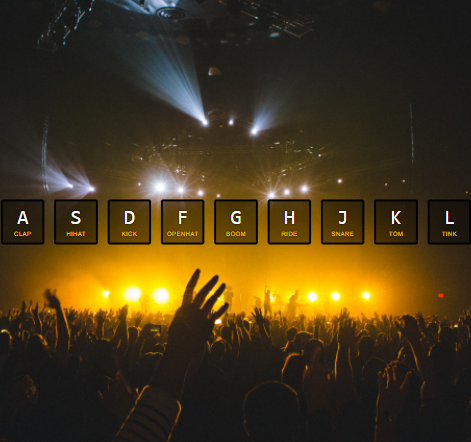
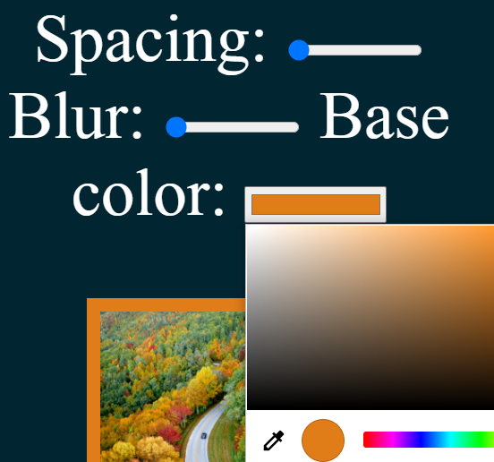
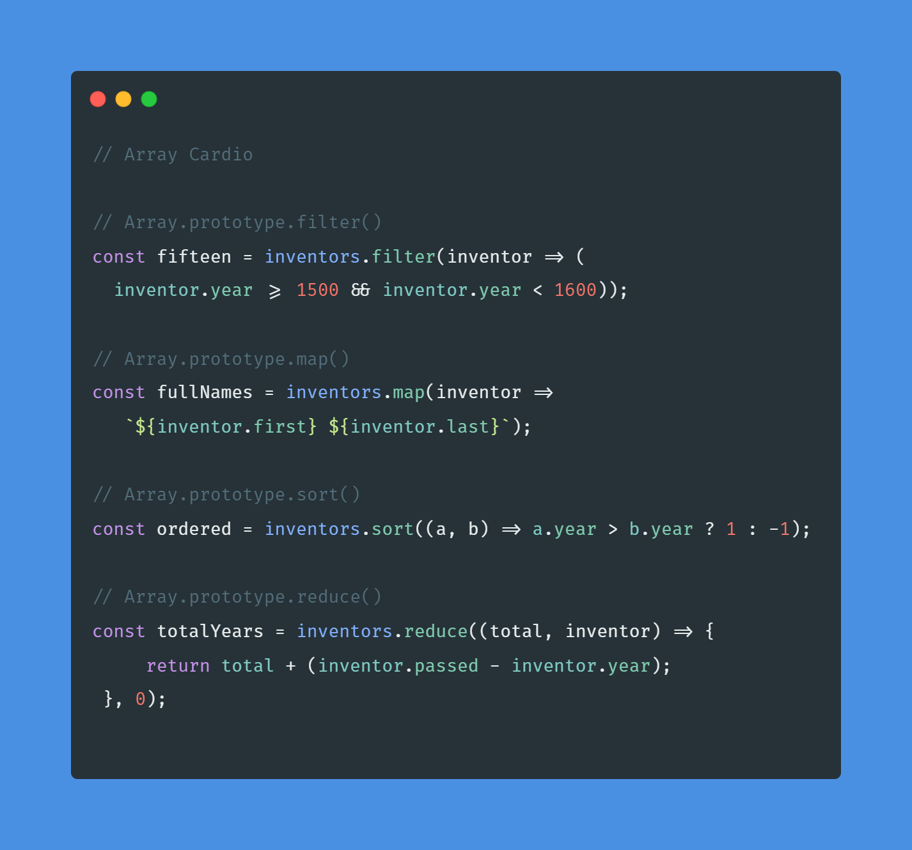
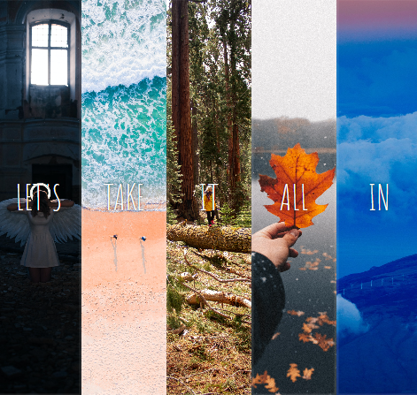

<!DOCTYPE html>
<html lang="en">

<head>
    <meta charset="UTF-8">
    <meta http-equiv="X-UA-Compatible" content="IE=edge">
    <meta name="viewport" content="width=device-width, initial-scale=1.0">
    <title>JavaScript30</title>
    <link rel="stylesheet" href="style.css">
    <link rel="preconnect" href="https://fonts.gstatic.com">
    <link href="https://fonts.googleapis.com/css2?family=Libre+Baskerville:wght@700&family=Pangolin&display=swap"
        rel="stylesheet">
</head>

<body>
    <h1>My JavaScript30 Projects</h1>
    <ul class="card-list">
        <li class="card-item">
            <a href="01. drum-kit/index.html">
                

                    
                    
Day 01: Drum kit

                

            </a>
        </li>
        <li class="card-item">
            <a href="02. JS-Clock/index.html">
                

                    
                    
Day 02: JS Clock

                

            </a>
        </li>
        <li class="card-item">
            <a href="03. Playing-with-Css-JS/index.html">
                

                    
                    
Day 03: Playing with Css & JS

                

            </a>
        </li>
        <li class="card-item">
            <a href="04. Array-Cardio/index.html">
                

                    
                    
Day 04: Array Cardio

                

            </a>
        </li>
        <li class="card-item">
            <a href="05. Flex-Panel-Gallery/index.html">
                

                    
                    
Day 05: Flex Panel Gallery

                

            </a>
        </li>
    </ul>
</body>

</html>